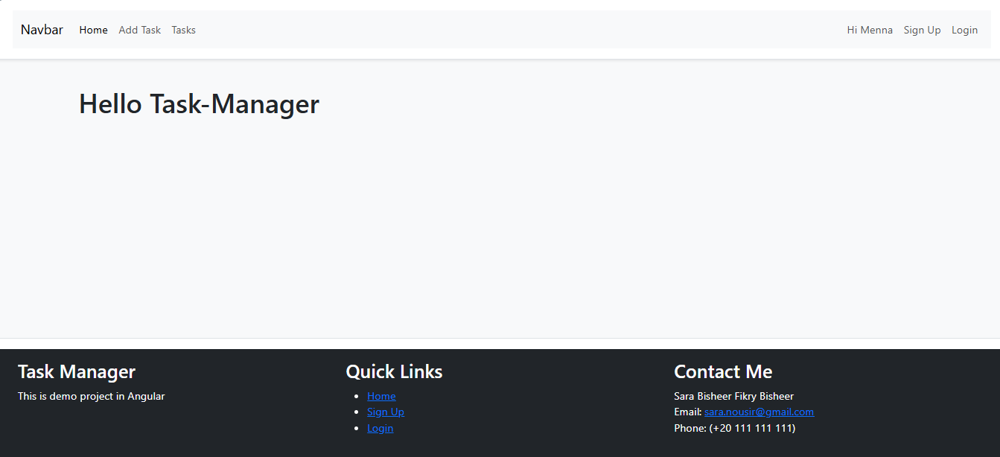
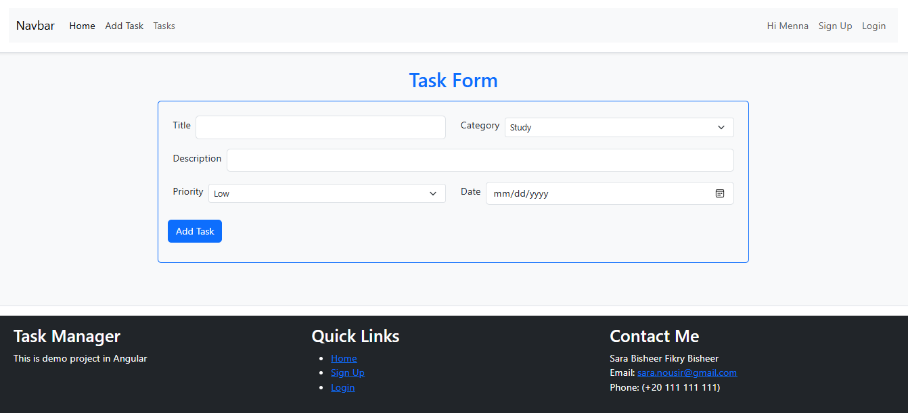
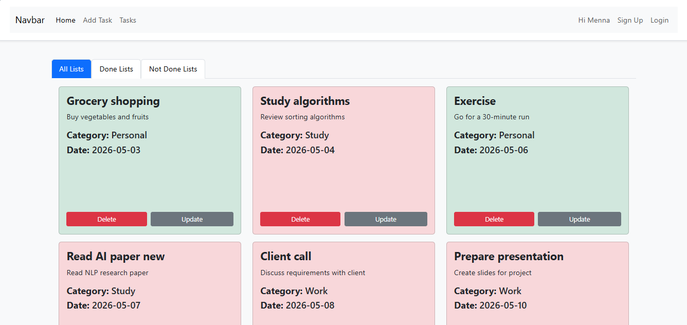
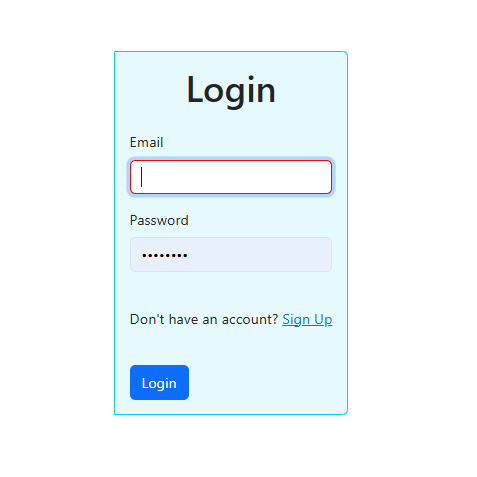
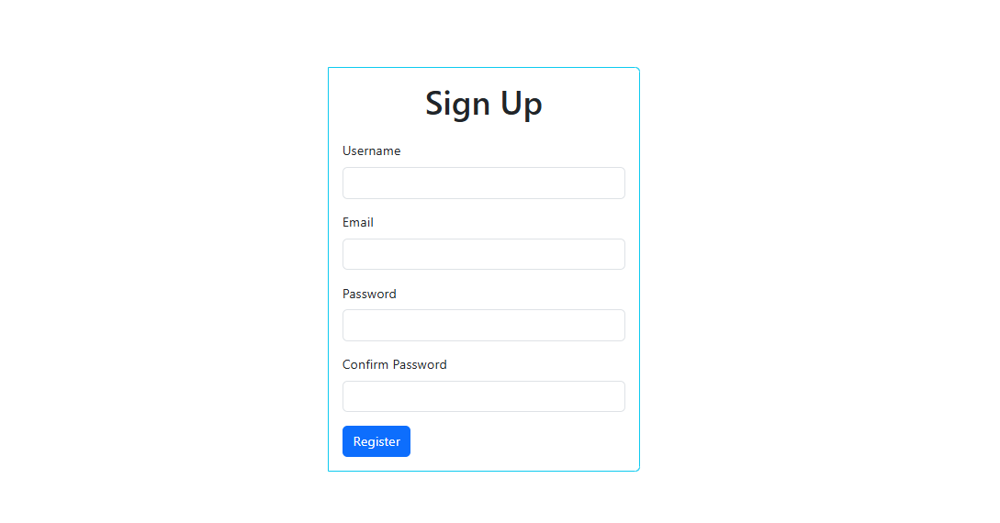

# Task Manager Demo

Task Manager Demo is an Angular application for signing up, logging in, and managing tasks with priorities, categories, and status tracking.

## Features

- User sign-up and login pages
- Auth-guard protected routes for authenticated users
- Home dashboard with task overview
- Add Task page to create tasks with title, description, priority, date, and category
- Tasks page to view existing tasks and track status
- 404 page for unknown routes
- Simple responsive layout with header, footer, and navigation

## Development server

To start a local development server, run:

```bash
ng serve
```

Once the server is running, open your browser and navigate to `http://localhost:4200/`. The application will automatically reload whenever you modify any of the source files.

## Screenshots

### Home Page



### Add Task Page



### Tasks Page



### Login Page



### Sign Up Page



### 404 Page


## Building

To build the project run:

```bash
ng build
```

This will compile your project and store the build artifacts in the `dist/` directory. By default, the production build optimizes your application for performance and speed.

## Additional Resources

For more information on using the Angular CLI, including detailed command references, visit the [Angular CLI Overview and Command Reference](https://angular.dev/tools/cli).
